# Findings, figure by figure

Every number here is recomputed by `notebooks/03_eda.ipynb` and `notebooks/04_findings.ipynb`
from the DuckDB database. Definitions (field request, derived benchmark, record gap, wait index)
are in the [README](../README.md#method).

## Headline numbers

| Metric | Value |
|---|---|
| Contacts, 2019-2025 | 3,010,330 |
| Field requests (tied to a Denver place) | 816,266 (27.1%) |
| Contacts closed within 15 minutes | 60.9% |
| Like-for-like field requests, 2019 to 2025 | +5.1% (100,745 to 105,837) |
| App share of field requests: 2019, 2022, 2025 | 22.9%, 48.1%, 25.7% |
| Request types that close slower via app | 14 of 14 |
| Type-years with a record gap | 13 of 175 |
| Civic questions answered on the spot, share of phone contacts | 15.0% |
| Neighborhood wait index range (75 neighborhoods, 500+ ranked requests) | 0.457 to 0.533 |
| Council district wait index range | 0.486 to 0.516 |

## Demand

**Figure 1. Contact outcomes by year.** Field requests are 23-37% of contacts depending on the
year. The rest are questions answered on the call, transfers to other agencies,
out-of-jurisdiction calls, and spam or duplicates.

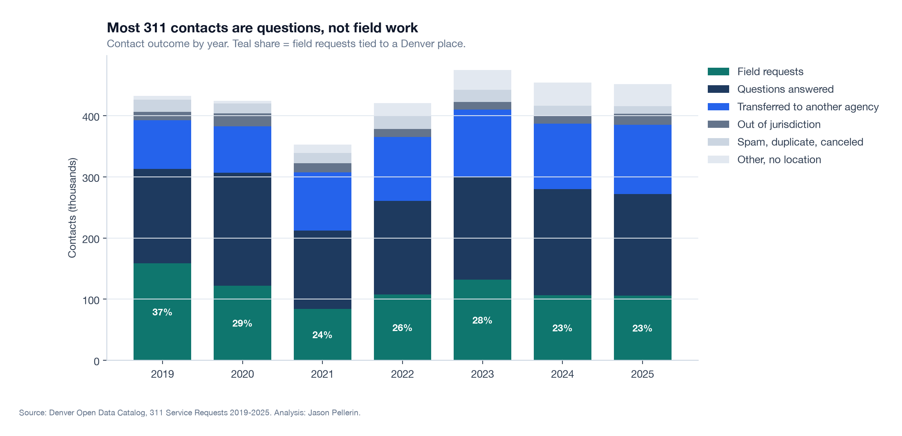

**Figure 2. Field volume, all vs like-for-like.** Solid-waste request types (75,873 in 2019,
37,965 in 2020, 10 in 2021) leave the 311 file. Without them, field requests rise 5.1% from 2019
to 2025, peaking at 131,807 in 2023. From 2024 most encampment reports are recorded as
transferred (91% in 2024, 80% in 2025), which lowers the field count further; the like-for-like
gain is therefore conservative.

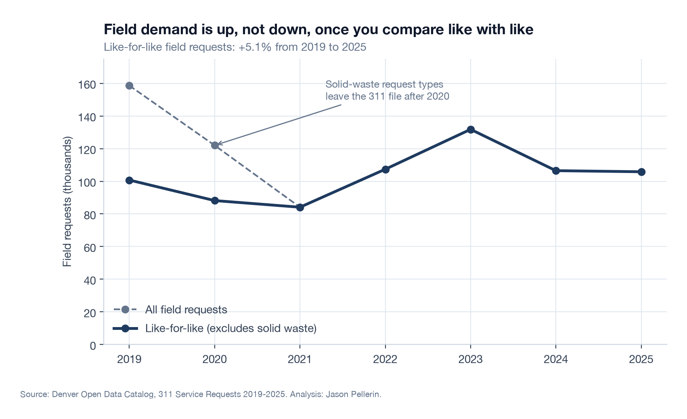

**Figure 3. Seasonal index by category.** Encampments June 2.02, Parks & Trees June 1.83,
Neighborhood Inspection January 1.63 (sidewalk snow), Solid Waste July 1.44.

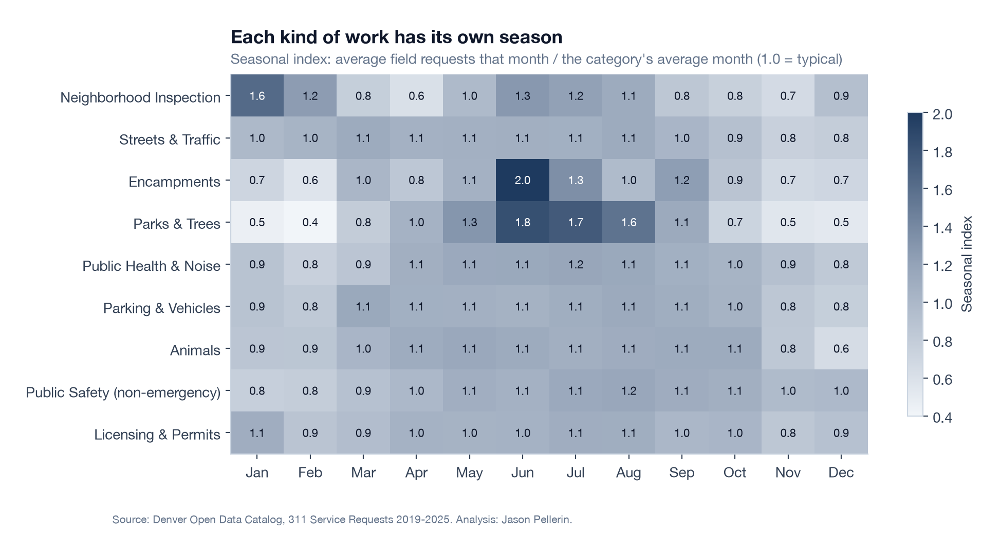

**Figure 4. Arrival pattern.** Field requests peak Tuesday 10-11am. Saturday and Sunday together
receive 9% of the week's field requests.

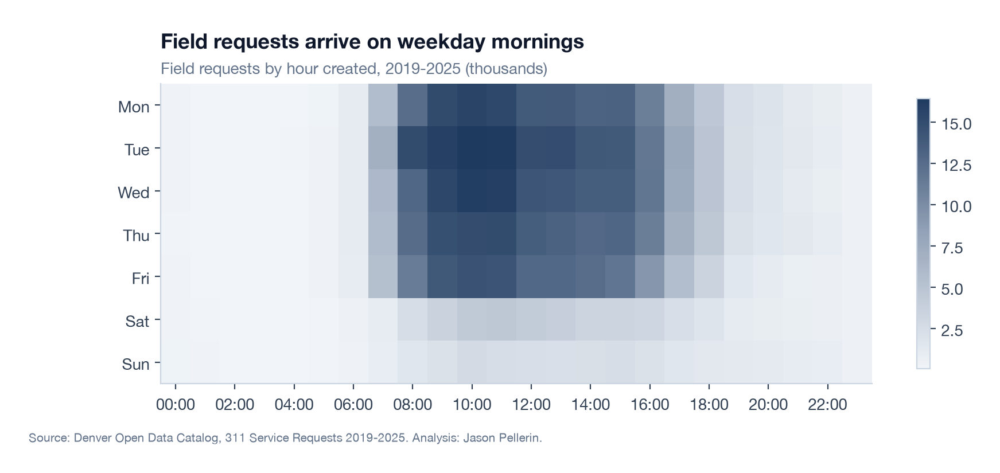

## Speed

**Figure 5. Time-to-close distributions.** Potholes close in a tight band. Illegal parking splits:
32% within an hour, 13% after 30 days, with the slow tail concentrated in 2023. Weed cases
typically run for weeks.

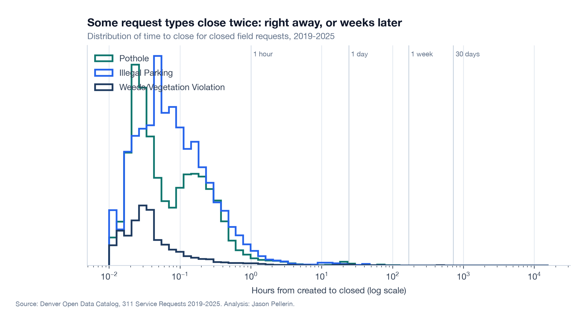

**Figure 6. P50 and P90 by type.** Inspection (P90 141 days) and Inquiry (135 days) carry the
longest tails. Illegal parking and signal timing have the widest spread: their P90 is 90x and 26x
their median.

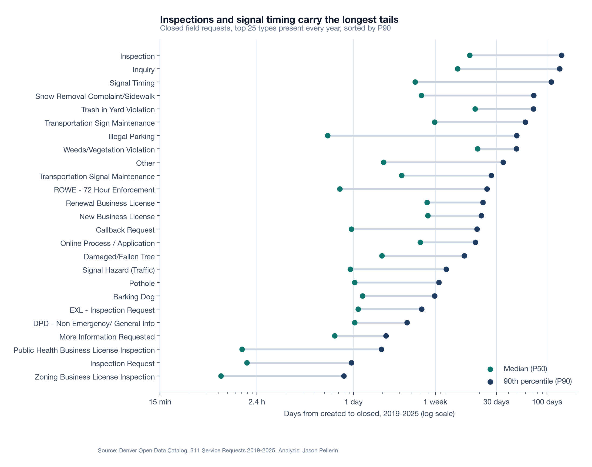

**Figure 7. Share closed within each type's own 2019 P90 (derived benchmark).** "gap" marks a
type-year whose closure record fails the integrity test.

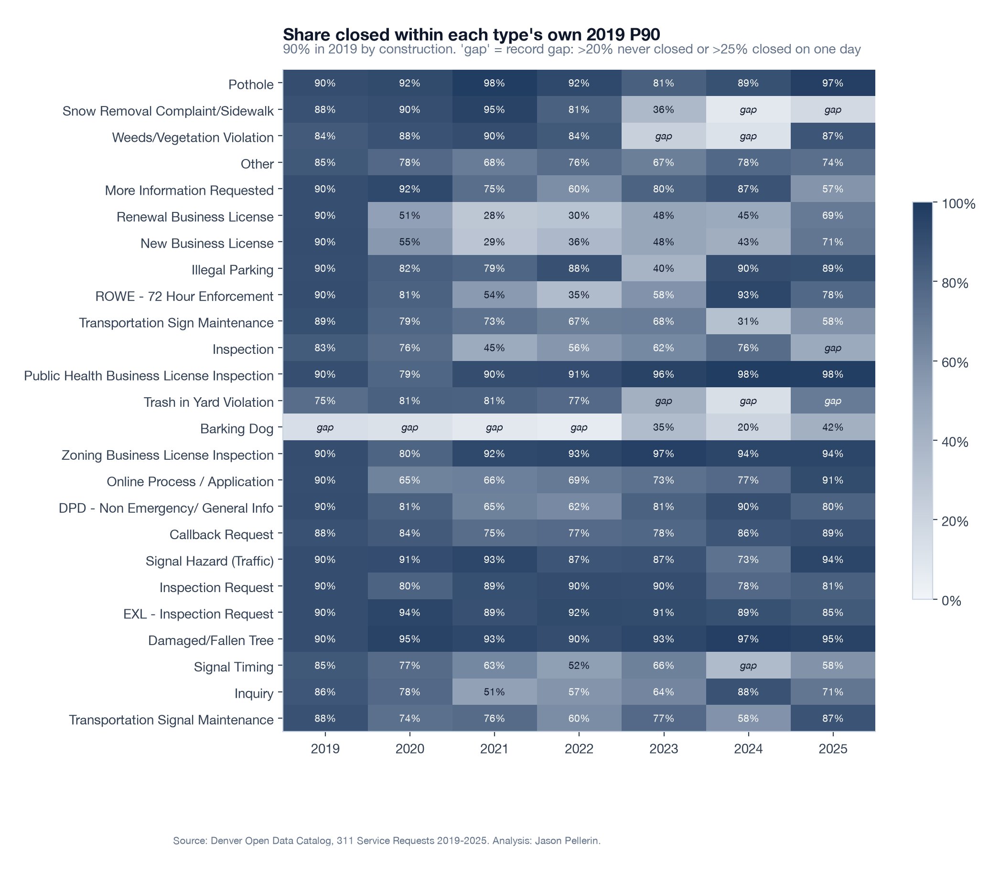

| Request type | 2019 | 2021 | 2023 | 2025 |
|---|---|---|---|---|
| New Business License, median days | 1.0 | 8.4 | 5.7 | 3.9 |
| New Business License, share within benchmark | 90% | 29% | 48% | 71% |
| Renewal Business License, median days | 1.0 | 8.1 | 5.0 | 2.9 |
| Pothole, median days | 1.8 | 0.7 | 2.3 | 1.8 |
| Pothole, share within benchmark | 90% | 98% | 81% | 97% |

**Figure 14. Against DOTI's published Level of Service goals (business days).** Potholes (5 days)
78-98% every year. The four signal and sign types held 86-99% through 2023, fell to 61-73% in
2024, and recovered to 78-94% in 2025.

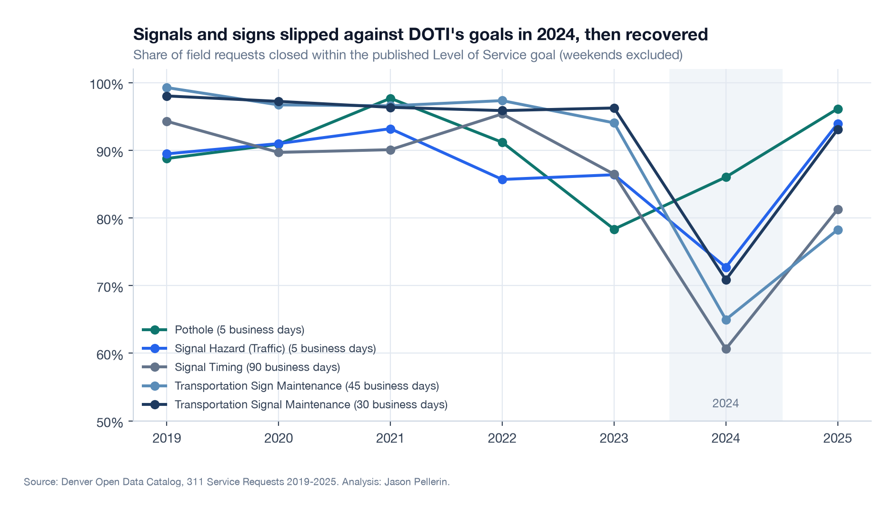

**Figure 8. The record gap.** Share never closed, and share closed on a single day, for three
code-enforcement types. 2023-2024 closures are missing; 83% of 2025 sidewalk snow closures are
dated May 6, 2025.

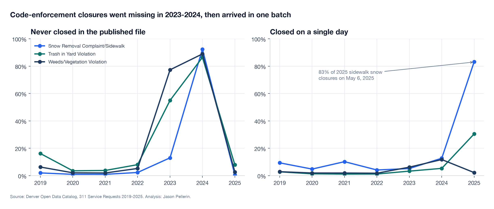

## Channel

**Figure 9. Channel share of field requests.** The app peaked at 48.1% in 2022 and fell back to
25.7% in 2025; phone returned to 68.7%.

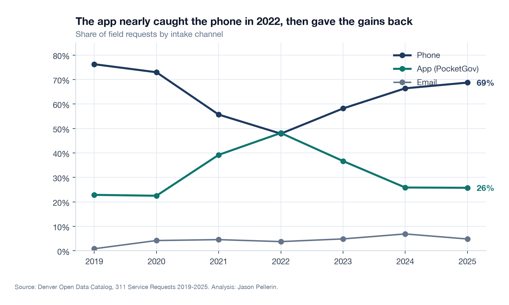

**Figure 10. Phone vs app median time to close.** App slower in all 14 types with 500+ closed on
each channel. Largest absolute gaps: Inquiry (260 hours), Signal Timing (109), Transportation
Signal Maintenance (81). Largest relative gap: Pothole (3.0 vs 50.4 hours).

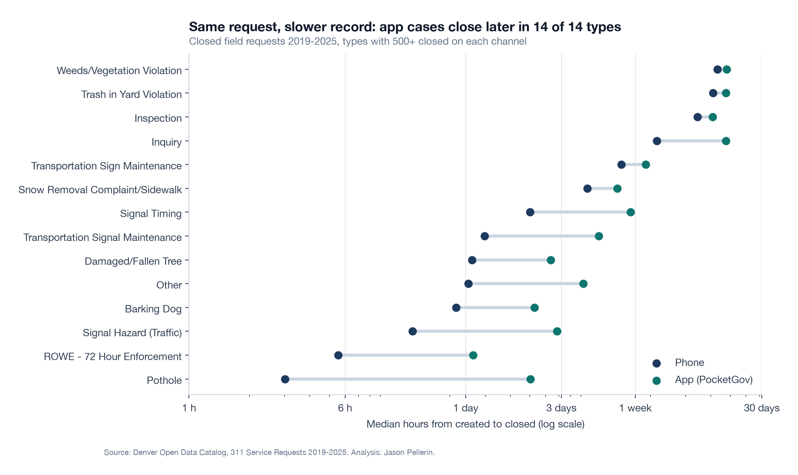

**Figure 11. Civic questions answered on the spot by phone.** 15.0% of all phone contacts. Trash
service schedule questions were 6,297 calls in 2025 alone.

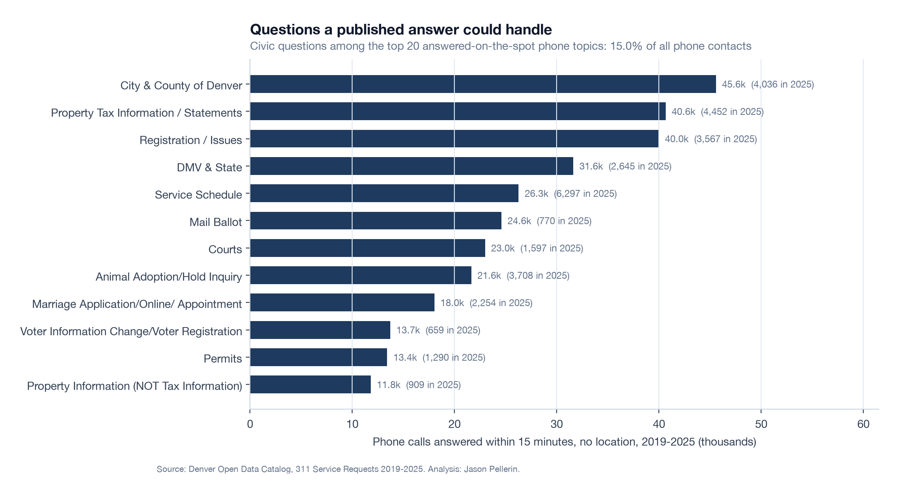

## Place

**Figure 12. Wait index by neighborhood.** Harvey Park South (0.457) is fastest and Cory-Merrill
(0.533) slowest among neighborhoods with 500+ ranked requests; Washington Park West (0.530) and
Washington Park (0.525) are next.

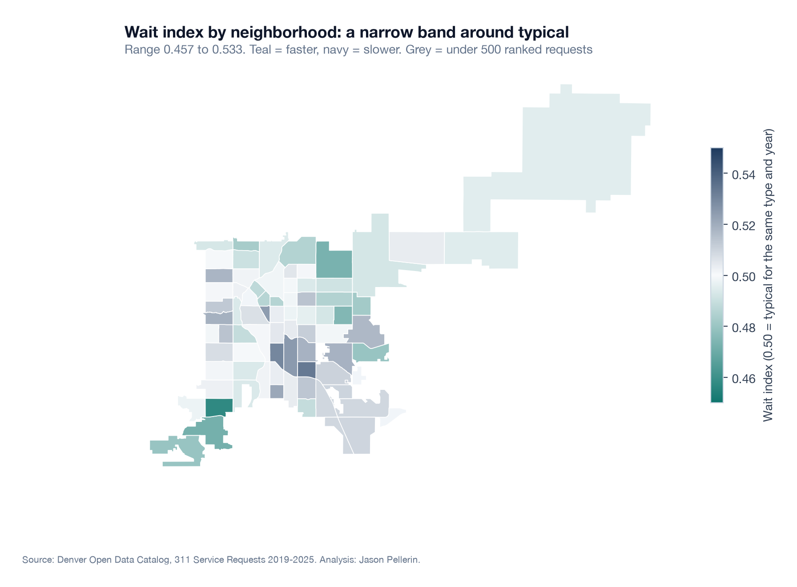

**Figure 13. Wait index vs income.** r = 0.06 with per-capita income, r = -0.05 with poverty rate.
Requests per resident do rise with poverty (r = 0.24).

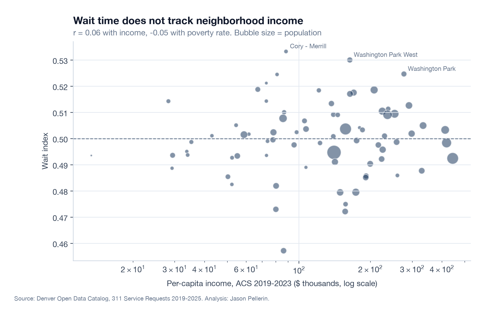
